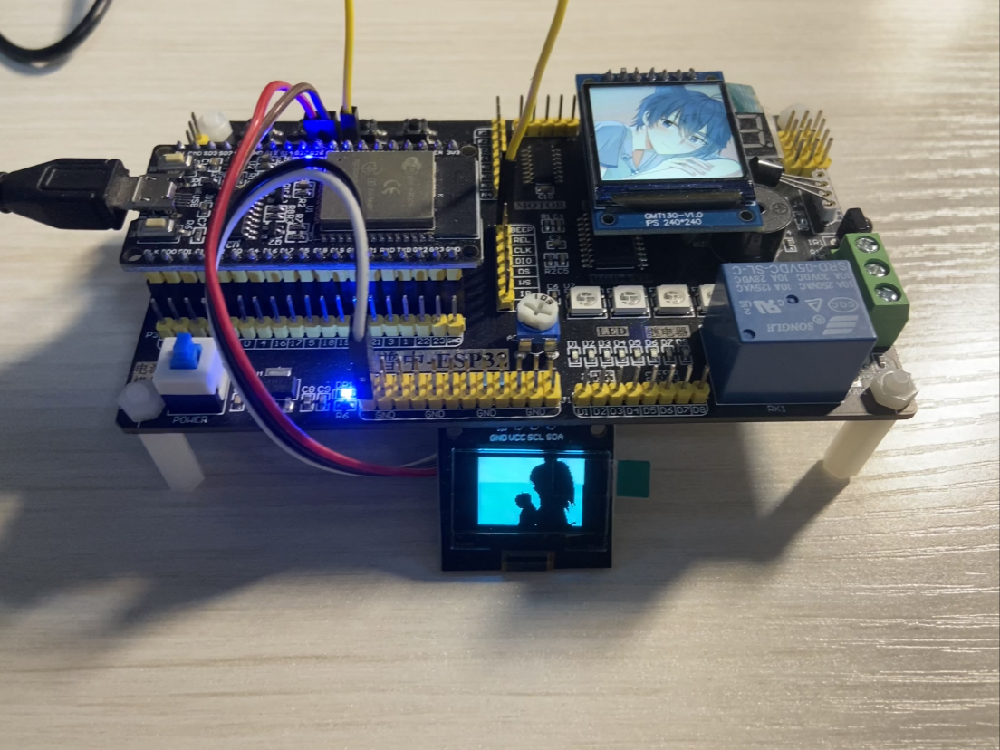

# ESP32-OLEDVideo-PWMMusic

一个使用 Python 和 MicroPython 编写的小型音视频项目

---

本项目以 [Bad Apple!! 影绘 PV](https://www.bilibili.com/video/BV1x5411o7Kn) 为例，在电脑端预先处理好视频和乐谱，然后在 ESP32 上使用单色 OLED12864 以 128\*64@60fps 或其他大小和分辨率播放给定的视频，使用 PWM 驱动蜂鸣器 或 使用 I2S 驱动 DAC 播放给定的音频。

## 效果演示

（右上角的 lcd 仅为显示头像使用，非项目必需，该项目不含其代码）

有录制视频并上传至 Bilibili 的计划

## 硬件

- 任意 ESP32 开发板
- ssd1306 驱动芯片的单色 OLED，分辨率 128\*64，I2C 接口
- 无源蜂鸣器（需要驱动） 或 支持 I2S 协议的 DAC 模块

### 测试环境

- PZ-ESP32 开发板，其板载模块的屏蔽罩丝印的是 ESP-WROOM-32，但使用 `esptool.exe flash_id` 读取到 `Chip is ESP32-D0WD-V3 (revision v3.0)`
- 普中-IIC OLED，蓝色，4 针 I2C
- 普中-ESP32 底板，使用 ULN2003D 驱动蜂鸣器
- WCMCU-1334 UDA1334A I2S 立体声解码模块

## 依赖

为了在电脑上进行视频处理，需要额外安装的 Python 库

| 工具                 | pip 库名        |
| -------------------- | --------------- |
| `video2frames.py`    | `opencv-python` |
| `frames2videohex.py` | `Pillow`        |

为了将进行视频的预处理，以及将视频处理为音频，需要额外安装 [`ffmpeg`](https://ffmpeg.org/download.html)

## 用法

### 1. 视频处理

0. 对源视频按照需求先进行一些预处理，比如旋转视频、调整 fps 、删除黑边，让 ffmpeg 来干吧
1. 将源视频放到项目文件夹里，默认名称为 `original.mp4`
2. 修改 `config.py` 头部的参数，以符合需求（参考文件内配置说明）
3. 运行 `video2frames.py` ，将视频拆分为每一帧的图像，其存储在 `\OrigFrames-xxxxxp-xxfps\` 中
4. 运行 `frames2videohex.py` ，将每一帧的图像处理并合并为用于 ESP32 上显示的 hex 视频文件
5. 将当前目录中生成的 hex 视频文件，例如 `video-13926p-60fps-4a26a634.hex` ，放进已格式化为 FAT32 文件系统的 SD 卡根目录中， `\sd-files-for-test\` 中有测试用文件，内容为 Bad Apple!! 影绘 PV。

### 2. 音频处理

1. 使用 I2S 播放音乐：
   1. `ffmpeg -i original.mp4 audio.wav`
   2. 将当前目录中生成的 `audio.wav` 放置到上述 SD 卡根目录中， `\sd-files-for-test\` 中有测试用文件，内容为 Bad Apple!! 影绘 PV。
2. 使用蜂鸣器播放乐谱：
   1. 待补充
   2. 见后文硬件配置第二步
3. 不播放音乐：
   1. 什么也不用做

### 3. 硬件配置

1. 修改 `mpycode\main.py` 头部定义的各模块与 ESP32 连接的引脚编号，并按需修改文件内其它参数

   | 模块     | 默认引脚编号                         |
   | -------- | ------------------------------------ |
   | I2C OLED | scl=25, sda=26                       |
   | SPI OLED | sck=16, mosi=17, dc=22, res=5, cs=21 |
   | SD 卡    | sck=18, miso=19, mosi=23, cs=4       |
   | I2S      | sck=32, sd=33, ws=27                 |
   | 蜂鸣器   | 15                                   |

2. 将开发板连接至电脑，利用 Thonny 或者别的适用于 SPIFFS 文件系统的软件将 `mpycode\` 中需要的文件写入 ESP32 设备内部文件系统的根目录中：

   - 必须上传的：
     - `ssd1306.py`
     - `main.py`
   - 可选上传的：
     - `musicscore.py`

   `musicscore.py` 与 `audio.wav` 仅需上传一个，都上传会播放 `audio.wav` ，都不上传则不播放音频

3. 按照步骤 1 内的配置，插入存储卡，连接 OLED 、蜂鸣器 / I2S 模块

4. 在 ESP32 上运行 `main.py` ，欣赏好康的画面与好汀的音乐

## 备注

- OLED12864 的 I2C 引脚必须使用硬件 I2C 引脚，使用软件 I2C 可能不支持 30fps 及以上的帧率
- fps>60 暂未测试，以测得的每帧时间来看，最大帧率可能在 71fps 左右
- SD 卡尽量使用 SD 卡(容量 ≤2GB)或 SDHC 卡(容量 2~32GB)
- 由于使用 Thonny 的 `运行当前脚本` 按钮运行 `main.py` 后，ESP32 会向 Thonny 返回当前系统变量，启动时会有短暂卡顿；使用物理 RST 按键复位并运行时则无此现象
- 请确保 I2S 模块与 ESP32 有着良好且无干扰的连接，以取得最佳的播放效果

## 代码参考

- 来自 Micropython 官方库 micropython/micropython-lib 的 ssd1306 OLED 驱动 [ssd1306.py](https://github.com/micropython/micropython-lib/blob/master/micropython/drivers/display/ssd1306/ssd1306.py)

- 来自 robert-hh/SH1106 的 sh1106 OLED 驱动 [sh1106.py](https://github.com/robert-hh/SH1106/blob/master/sh1106.py)

- 乐谱由 UTAU 歌曲文件(.ust)手动转换+补全而来：[Youtube](https://www.youtube.com/watch?v=GPnS1vDhqPc) [ust 配布地址](http://www.mediafire.com/?83drvmwkvifdja1)

- 本项目的音频部分由自己在 51 单片机上的项目移植、修改而来，该 C51 项目一开始参考了此视频的思路，并进行了优化：[Bilibili](https://www.bilibili.com/video/BV1sa411b7U3/) [代码配布地址](https://pan.baidu.com/s/18flDyiLVOPmjuAXGkhvKNQ?pwd=imkn)

- 初期参考了 [maysrp/badapple](https://github.com/maysrp/badapple) 仓库的绘制方式，但是逐行划线对性能有较大影响，且每帧所耗时间不同，导致部分帧卡顿，故未采用

- 将视频的每一帧进行处理的代码参考了 [Lei-Tin/BinaryBadApple](https://github.com/Lei-Tin/BinaryBadApple)

- 视频抽帧代码参考了 [ChatGPT](https://chat.openai.com/) 的回答

- I2S 部分代码参考了 [miketeachman/micropython-i2s-examples](https://github.com/miketeachman/micropython-i2s-examples)

- MicroPython 官方 [英文文档](https://docs.micropython.org/en/latest/) [中文文档](http://micropython.com.cn/en/latet/index.html)

## 后续计划

### 1.视频部分

- ☑️ 添加适用于 SPI 接口 OLED 的代码

- ⏩ 添加适用于 SH1106 驱动的 1.3" OLED 的代码

- 添加适用于其他分辨率的 OLED 的代码

### 2.音频部分

- ☑️ 使用 ESP32 的 I2S 播放更清晰的音频

- ⏩ 测试 PCM5102 、 CS4344 等 I2S 模块的支持情况

- 使用 DAC 直接播放音频

- 提供自动由 .midi 或 .ust 转为乐谱文件的方法

### 3.主控部分

- 添加用于 ESP32-S3 、 ESP32-C3 单片机上的 MicroPython 代码

- （远期）添加用于 STM32F412RET6（类 pyboard）、RP2040 单片机上的 MicroPython 代码

### 4.其它

- 录制效果视频

- ⏩ 添加将视频 hex 视频文件与 wav 上传于 flash 内的无 SD 卡的测试选项

- 编写可以预览视频 hex 视频文件中视频的桌面程序
